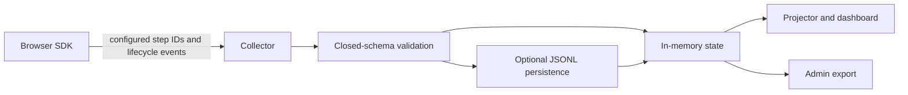

<div align="center">

# Calibrate

Self-hosted, position-only observability for onboarding flows.

[](https://www.npmjs.com/package/usecalibrate)
[](https://nodejs.org)
[](./LICENSE)

[Package reference](./packages/kit/README.md) | [Agent Skill](./packages/kit/skills/install-calibrate/SKILL.md) | [Deploy to Render](https://render.com/deploy?repo=https%3A%2F%2Fgithub.com%2Fojusave%2Fusecalibrate)

</div>

Calibrate shows where people stall in a known onboarding flow without recording what they type. You define stable step IDs and route mappings. The browser SDK emits those positions and a bounded set of lifecycle signals to a collector you control.

It does not scan the DOM, infer form fields, read input values, capture clipboard contents, or send URLs. This makes Calibrate a focused fit for workshops, product evaluations, and small onboarding flows where position and completion matter more than session replay.

## Choose your path

| Goal | Start here |
|---|---|
| Integrate the SDK yourself | [Human quickstart](#human-quickstart) |
| Ask a coding agent to install it | [Agent installation](#agent-installation) |
| Review all browser, server, and sidecar options | [Package reference](./packages/kit/README.md) |
| Deploy the sidecar | [Deployment](#deployment) |
| Work on Calibrate itself | [Development](#development) |

## Implementation walkthrough

Watch the complete local integration flow, from repository inspection and installer planning through verification, onboarding navigation, and the dashboard view:

[](./docs/videos/calibrate-implementation-walkthrough.mp4)

The video is a local storyboard render. Replace it with a capture containing the actual terminal, browser, and dashboard session before using it as proof of a live run.

## What Calibrate records

- Named positions such as `account`, `project`, and `success`
- Forward and back navigation between configured steps
- Step completion and elapsed time
- Bounded machine error codes
- Named copy actions and whether a paste was accepted, never clipboard content
- Successful flow completion

The collector accepts a closed event schema and drops unknown fields. Integrators must still use fixed machine identifiers and must never put user-provided content into step IDs, error codes, or artifact names.

## Human quickstart

Install the public ESM package. Server and sidecar use require Node.js 20 or newer.

```sh
npm install usecalibrate
```

### 1. Start a collector

The standalone sidecar needs three distinct credentials and a manifest. These values are examples only.

```sh
ADMIN_TOKEN=local-admin-only \
DASHBOARD_TOKEN=local-dashboard-only \
WRITE_KEY=local-browser-write-key \
ALLOWED_ORIGINS=http://localhost:5173 \
MANIFEST_JSON='{"version":"onboarding-v1","groups":["signup"],"steps":[{"id":"account","group":"signup"},{"id":"success","group":"signup"}]}' \
npx calibrate-sidecar
```

The sidecar listens on `http://localhost:8787` by default. It stores state in memory unless `PERSIST_PATH` points to a writable JSONL file.

### 2. Map routes to onboarding steps

```ts
import { calibrate } from "usecalibrate";

const fm = calibrate({
  endpoint: "http://localhost:8787",
  writeKey: "local-browser-write-key",
  manifest: {
    version: "onboarding-v1",
    groups: ["signup"],
    steps: [
      { id: "account", group: "signup" },
      { id: "success", group: "signup" }
    ]
  },
  routes: [
    { path: "/signup", step: "account" },
    { path: "/welcome", step: "success", shipped: true }
  ]
});

await fm.ready;
```

Open the configured routes in your app, then visit `http://localhost:8787/dashboard#token=local-dashboard-only` for the interactive dashboard. Use `http://localhost:8787/present#token=local-dashboard-only` for the full-screen workshop projector. For same-origin applications, you can instead [mount the Hono collector inside your app](./packages/kit/README.md#embedded-hono-collector).

The package reference covers the [controller API](./packages/kit/README.md#controller-api), [route behavior](./packages/kit/README.md#route-configuration), [manifest rules](./packages/kit/README.md#manifest), and [package exports](./packages/kit/README.md#package-exports).

## Agent installation

Calibrate includes a portable [Agent Skill](./packages/kit/skills/install-calibrate/SKILL.md) and a machine-readable, plan-before-write installer. The agent detects the application, proposes fixed route IDs, writes a reviewable plan, waits for approval, applies only that plan, and verifies the result.

Install `usecalibrate@0.1.4` or newer in the target application. The package includes the interactive dashboard, installer CLI, and portable skill at `node_modules/usecalibrate/skills/install-calibrate`. Make that skill directory available to your coding agent using its normal Agent Skills installation method.

```sh
npm install usecalibrate
```

Then ask the agent:

> Install Calibrate for this application's onboarding flow. Inspect the proposed routes, show me the plan before changing files, then verify the completed integration.

The underlying commands are deterministic and emit JSON:

```sh
npx calibrate detect --dir . --json
npx calibrate plan --dir . --out calibrate.plan.json
# Review calibrate.plan.json and the proposed route-to-step mappings.
npx calibrate apply --plan calibrate.plan.json --yes
npx calibrate verify --dir . --json
```

The first installer release supports React with Vite and generic ESM browser applications. Ambiguous entry points and route mappings stop for human judgment. See the [skill instructions](./packages/kit/skills/install-calibrate/SKILL.md) for the complete workflow and runtime privacy check.

## Architecture



The browser SDK cannot start a shared backend. Run the standalone sidecar or mount `createCalibrate()` in an existing Hono app. The browser uses a write key, dashboard reads use a dashboard token, and export or reset operations use an admin token.

## Privacy and security boundaries

Calibrate's data minimization is enforced in both client behavior and collector validation:

- The route observer sends configured step IDs instead of URLs, pathnames, queries, or hashes.
- The SDK does not read form values, textarea values, clipboard contents, DOM text, arbitrary attributes, or cookies.
- Events use a closed schema. Unknown fields and invalid identifiers are rejected at ingestion.
- Browser instrumentation is fault-isolated and does not throw into the host application.

Calibrate does not make browser credentials secret. Treat `WRITE_KEY` and a browser-visible `DASHBOARD_TOKEN` as scoped workshop credentials, restrict `ALLOWED_ORIGINS`, and rotate them when needed. Never expose `ADMIN_TOKEN` in browser code. Calibrate is onboarding telemetry, not user authentication, authorization, or a general-purpose analytics warehouse.

## Deployment

The repository includes a [Render Blueprint](./render.yaml) for the standalone sidecar:

[](https://render.com/deploy?repo=https%3A%2F%2Fgithub.com%2Fojusave%2Fusecalibrate)

The Blueprint creates one paid Starter web service, generates the three credentials, requires the manifest and allowed origins, disables previews and automatic deploys, and uses in-memory state by default.

The deployed service root returns a public status document. The interactive UI at `/dashboard` and projector at `/present` fetch protected aggregates with `DASHBOARD_TOKEN`.

To preserve events across restarts, uncomment `PERSIST_PATH` and the disk block in `render.yaml`. Render persistent disks require a paid service, can attach to only one service instance, and disable zero-downtime deploys. Review [Render's persistent disk documentation](https://render.com/docs/disks) before enabling this option.

You can also run the built sidecar on any Node.js 20 host:

```sh
node packages/kit/dist/sidecar.js
```

## Development

```sh
npm ci
npm run build --workspace usecalibrate
npm run verify
npm run smoke:package
```

`npm run verify` runs linting, type checks, tests, package checks, and repository policy checks. `npm run smoke:package` packs `usecalibrate`, installs it into a fresh application, and exercises the installer and package entry points.

The current public package lives in [`packages/kit`](./packages/kit). The other `@usecalibrate/*` directories are internal workspace packages and are not published separately.

## Current limits

- Calibrate is pre-1.0 and its API may change.
- The collector is single-process. Multiple instances do not coordinate or share state.
- State resets after restart or deployment unless optional JSONL persistence is enabled.
- JSONL persistence requires one instance and replays the file at startup.
- Browser-visible write and dashboard credentials provide workshop isolation, not end-user authentication.
- The default collector limits and 24-hour retention target small workshops and evaluations.
- The agent installer currently supports React/Vite and generic ESM browser applications.

## License

[Apache-2.0](./LICENSE)
