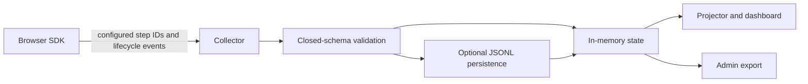

<div align="center">

# Calibrate

Self-hosted, position-only observability for onboarding flows.

[](https://www.npmjs.com/package/usecalibrate)
[](https://nodejs.org)
[](./LICENSE)

[Package reference](./packages/kit/README.md) | [Agent Skill](./packages/kit/skills/install-calibrate/SKILL.md) | [Deploy to Render](https://render.com/deploy?repo=https%3A%2F%2Fgithub.com%2Fojusave%2Fusecalibrate)

</div>

Calibrate shows where people stall in a known onboarding flow without recording what they type. You define stable step IDs and route mappings. The browser SDK emits those positions and a bounded set of lifecycle signals to a collector you control.

It does not scan the DOM, infer form fields, read input values, capture clipboard contents, or send URLs. This makes Calibrate a focused fit for workshops, product evaluations, and small onboarding flows where position and completion matter more than session replay.

## Before you start

- Browser use needs an ESM-aware bundler or runtime. The installer, server, and sidecar require Node.js 20 or newer.
- Calibrate needs a collector. The browser SDK cannot start or deploy one.
- A first evaluation needs two fixed onboarding routes, including one route that means the flow shipped.
- The sidecar needs three distinct credentials: a browser write key, a browser-visible dashboard token, and a server-only admin token.
- Sidecar data is in memory by default and resets when the process restarts.

## Choose one architecture

| Starting point | Use | Start here |
|---|---|---|
| No collector yet | Local standalone sidecar | [Ten-minute local quickstart](#ten-minute-local-quickstart) |
| Existing Calibrate collector | Guided installer | [Install against an existing collector](#install-against-an-existing-collector) |
| Existing Hono server | Embedded collector | [Embedded Hono collector](./packages/kit/README.md#embedded-hono-collector) |
| Coding agent will integrate it | Plan-before-write installer | [Agent installation](#agent-installation) |
| Production sidecar deployment | Render Blueprint | [Deployment](#deployment) |

## What Calibrate records

- Named positions such as `account`, `project`, and `success`
- Forward and back navigation between configured steps
- Step completion and elapsed time
- Bounded machine error codes
- Named copy actions and whether a paste was accepted, never clipboard content
- Successful flow completion

The collector accepts a closed event schema and drops unknown fields. Integrators must still use fixed machine identifiers and must never put user-provided content into step IDs, error codes, or artifact names.

## Ten-minute local quickstart

This default path uses a React/Vite application with existing `/signup` and `/welcome` routes. Replace those two paths with your application's real onboarding routes.

### 1. Install and confirm the package version

```sh
npm install usecalibrate@^0.1.4
npm ls usecalibrate --depth=0
```

Expected: `usecalibrate@0.1.4` or newer. The guided `install` command is unavailable in older releases.

### 2. Start a local collector

In terminal 1, run the sidecar with example-only local credentials:

```sh
ADMIN_TOKEN=local-admin-only \
DASHBOARD_TOKEN=local-dashboard-only \
WRITE_KEY=local-browser-write-key \
ALLOWED_ORIGINS=http://localhost:5173 \
MANIFEST_JSON='{"version":"onboarding-v1","groups":["signup"],"steps":[{"id":"account","group":"signup"},{"id":"success","group":"signup"}]}' \
npx calibrate-sidecar
```

Expected output begins with:

```text
calibrate sidecar listening on
```

Leave terminal 1 running. The sidecar listens on `http://localhost:8787` and holds data in memory for this evaluation.

### 3. Confirm the collector is ready

In terminal 2:

```sh
curl -s http://localhost:8787/healthz
```

Expected:

```json
{"ok":true}
```

### 4. Preview and apply the application changes

Still in terminal 2, from the application directory:

```sh
npx usecalibrate install \
  --url http://localhost:8787 \
  --route /signup=account \
  --route /welcome=success:shipped
```

Review the route meanings, file changes, dependency command, and required environment names. Enter `y` only when they are correct.

Expected after approval:

```text
Calibrate install: installed
Evidence: artifact
Static installation verification passed.
```

### 5. Start the application and prove the browser path

In terminal 3:

```sh
VITE_CALIBRATE_WRITE_KEY=local-browser-write-key npm run dev
```

Open `/signup`, continue to `/welcome`, then open:

```text
http://localhost:8787/dashboard#token=local-dashboard-only
```

Done means the dashboard shows the `account` step was reached and the shipped count increased. A static installer result or passing build alone does not prove the browser path works.

## Install against an existing collector

Install the public ESM package, then point the guided installer at a collector that is already running:

```sh
npm install usecalibrate@^0.1.4
npx usecalibrate install --url https://your-calibrate-collector.example
```

The installer checks `/healthz`, `/api/manifest`, and `/dashboard` before touching project files. It shows the remote manifest, proposed route mappings, file changes, dependency command, and required environment names, then asks for confirmation. Add explicit routes when detection is ambiguous:

```sh
npx usecalibrate install \
  --url https://your-calibrate-collector.example \
  --route /signup=account \
  --route /welcome=success:shipped
```

Set `CALIBRATE_WRITE_KEY` in the environment only when you want the installer to send a synthetic journey to the collector. That check verifies collector ingestion and privacy rejection. It does not prove that the real application loaded the SDK or emitted browser events.

The browser SDK is bundled with your application. The collector remains a separate standalone or embedded service and serves its dashboard at `<collector-url>/dashboard`.

The package reference covers the [controller API](./packages/kit/README.md#controller-api), [route behavior](./packages/kit/README.md#route-configuration), [manifest rules](./packages/kit/README.md#manifest), and [package exports](./packages/kit/README.md#package-exports).

## Common first-use failures

| Symptom | Next action |
|---|---|
| `unknown option` or the `install` command is missing | Run `npm ls usecalibrate --depth=0`; guided installation requires 0.1.4 or newer. |
| `curl` cannot reach `/healthz` | Return to the collector terminal and fix its first error before continuing. |
| Installer exits with code `3` | Resolve the reported route, entry-point, or support decision. Project files should remain unchanged. |
| The app runs but dashboard counts do not change | Confirm the browser write key, exact route paths, collector URL, and `ALLOWED_ORIGINS`. |
| The dashboard reports unauthorized | Open `/dashboard#token=<DASHBOARD_TOKEN>` with the collector's dashboard token, not its write or admin credential. |

## Agent installation

Calibrate includes a portable [Agent Skill](./packages/kit/skills/install-calibrate/SKILL.md) and a machine-readable, plan-before-write installer. The agent detects the application, proposes fixed route IDs, writes a reviewable plan, waits for approval, applies only that plan, and verifies the result.

Install `usecalibrate@0.1.4` or newer in the target application. The package includes the interactive dashboard, installer CLI, and portable skill at `node_modules/usecalibrate/skills/install-calibrate`. Make that skill directory available to your coding agent using its normal Agent Skills installation method.

```sh
npm install usecalibrate@^0.1.4
```

Then ask the agent:

> Install Calibrate for this application's onboarding flow. Inspect the proposed routes, show me the plan before changing files, then verify the completed integration.

The underlying commands are deterministic and emit JSON:

```sh
npx usecalibrate install --url https://collector.example --json
# Review the returned plan and exact generated contents. No files changed.
npx usecalibrate install --url https://collector.example --yes --json
# Or use the lower-level plan workflow:
npx calibrate detect --dir . --json
npx calibrate plan --dir . --out calibrate.plan.json
# Review calibrate.plan.json and the proposed route-to-step mappings.
npx calibrate apply --plan calibrate.plan.json --yes
npx calibrate verify --dir . --json
```

The first installer release supports React with Vite and generic ESM browser applications. Ambiguous entry points and route mappings stop for human judgment. Exit code `3` should leave project files unchanged. A failure after writes must report the changed files and failing check; do not revert user changes automatically.

The agent must distinguish three outcomes:

- **Static integration verified:** generated files, dependency installation, build or typecheck, and static checks passed.
- **Collector runtime verified:** a synthetic journey and privacy-rejection check reached the collector.
- **Application flow validated:** the real application loaded the SDK, mapped routes were visited, and an expected dashboard count changed.

See the [skill instructions](./packages/kit/skills/install-calibrate/SKILL.md) for the complete approval, recovery, and verification workflow.

## Architecture



The browser SDK cannot start a shared backend. Run the standalone sidecar or mount `createCalibrate()` in an existing Hono app. The browser uses a write key, dashboard reads use a dashboard token, and export or reset operations use an admin token.

## Privacy and security boundaries

Calibrate's data minimization is enforced in both client behavior and collector validation:

- The route observer sends configured step IDs instead of URLs, pathnames, queries, or hashes.
- The SDK does not read form values, textarea values, clipboard contents, DOM text, arbitrary attributes, or cookies.
- Events use a closed schema. Unknown fields and invalid identifiers are rejected at ingestion.
- Browser instrumentation is fault-isolated and does not throw into the host application.

Calibrate does not make browser credentials secret. Treat `WRITE_KEY` and a browser-visible `DASHBOARD_TOKEN` as scoped workshop credentials, restrict `ALLOWED_ORIGINS`, and rotate them when needed. Never expose `ADMIN_TOKEN` in browser code. Calibrate is onboarding telemetry, not user authentication, authorization, or a general-purpose analytics warehouse.

## Deployment

The repository includes a [Render Blueprint](./render.yaml) for the standalone sidecar:

[](https://render.com/deploy?repo=https%3A%2F%2Fgithub.com%2Fojusave%2Fusecalibrate)

The Blueprint creates one paid Starter web service, generates the three credentials, requires the manifest and allowed origins, disables previews and automatic deploys, and uses in-memory state by default.

The deployed service root returns a public status document. The interactive UI at `/dashboard` and projector at `/present` fetch protected aggregates with `DASHBOARD_TOKEN`.

To preserve events across restarts, uncomment `PERSIST_PATH` and the disk block in `render.yaml`. Render persistent disks require a paid service, can attach to only one service instance, and disable zero-downtime deploys. Review [Render's persistent disk documentation](https://render.com/docs/disks) before enabling this option.

You can also run the built sidecar on any Node.js 20 host:

```sh
node packages/kit/dist/sidecar.js
```

## Development

```sh
npm ci
npm run build --workspace usecalibrate
npm run verify
npm run smoke:package
```

`npm run verify` runs linting, type checks, tests, package checks, and repository policy checks. `npm run smoke:package` packs `usecalibrate`, installs it into a fresh application, and exercises the installer and package entry points.

The current public package lives in [`packages/kit`](./packages/kit). The other `@usecalibrate/*` directories are internal workspace packages and are not published separately.

## Current limits

- Calibrate is pre-1.0 and its API may change.
- The collector is single-process. Multiple instances do not coordinate or share state.
- State resets after restart or deployment unless optional JSONL persistence is enabled.
- JSONL persistence requires one instance and replays the file at startup.
- Browser-visible write and dashboard credentials provide workshop isolation, not end-user authentication.
- The default collector limits and 24-hour retention target small workshops and evaluations.
- The agent installer currently supports React/Vite and generic ESM browser applications.

## License

[Apache-2.0](./LICENSE)
